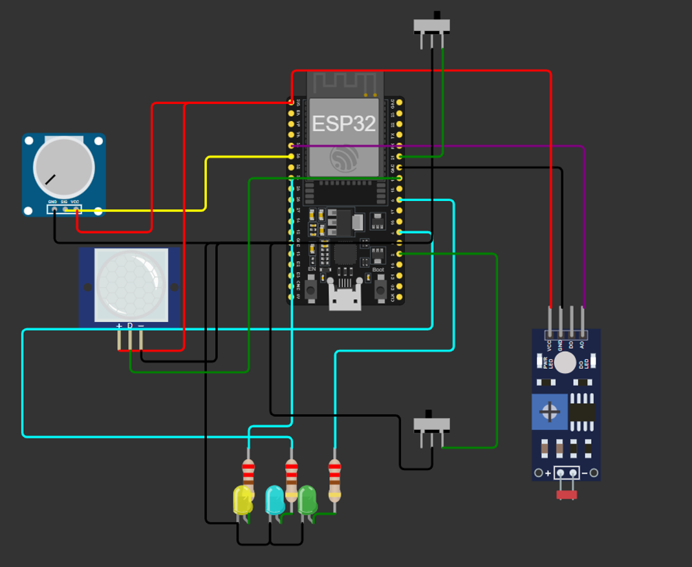

# Smart Lighting System using ESP32 💡

A smart lighting system built using **ESP32** that automatically controls lights based on **motion detection**, **light intensity**, and **manual input**. This project demonstrates the basics of IoT, sensors, and embedded programming.

---

## 🔧 Components Used
- ESP32 Development Board  
- PIR Motion Sensor  
- LDR (Light Dependent Resistor) Module  
- Potentiometer  
- LEDs (Green, Blue, Yellow)  
- Resistors  
- Jumper Wires  

---

## ⚙️ Working Principle
- The **PIR sensor** detects human motion.
- The **LDR module** measures ambient light intensity.
- The **potentiometer** is used to adjust sensitivity/threshold values.
- Based on sensor inputs:
  - Lights turn **ON** when motion is detected in low-light conditions.
  - Lights remain **OFF** when sufficient ambient light is available.
- LEDs indicate different system states.

---

## 🧠 Features
- Automatic light control
- Energy-efficient system
- Manual sensitivity adjustment
- Real-time sensor interaction
- Beginner-friendly IoT project

---

## 🖥️ Simulation
This project was designed and tested using **Wokwi Simulator**.

🔗 **Wokwi Project Link:**  
https://wokwi.com/projects/449938141065819137

---

## 📂 Project Files
smart-lighting-system/
│── sketch.ino # ESP32 source code
│── diagram.json # Circuit diagram (Wokwi)
│── README.md # Project documentation

---

## 🔌 Circuit Diagram

  

---

## 🚀 How to Run
1. Open the Wokwi link or clone this repository.
2. Upload `sketch.ino` to ESP32 using Arduino IDE.
3. Connect components as shown in the circuit diagram.
4. Power the ESP32 and observe automatic lighting behavior.

---

## 📌 Applications
- Smart homes
- Energy-saving lighting systems
- Automated classrooms
- IoT-based automation projects

---

## 👨‍💻 Author
**Hariharasudhan D**  
Aspiring Software / IoT Developer  